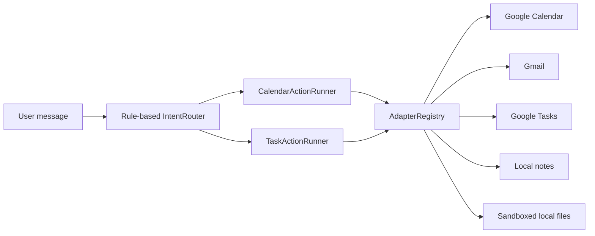

# MyVibe / VibeOS

VibeOS is a small personal automation layer that turns user intent into actions
across external tools. The current build focuses on adapter foundations: each
adapter normalizes a tool behind a small Python interface so a planner can call
it later.


## Project snapshot

| Verified from the repository | Count |
| --- | ---: |
| Normalized service adapters | **5** |
| Calendar and task intents | **7** |
| Google API integrations | **3** |
| Unit-test modules | **4** |
| Python source files | **15** |

## Architecture preview



> **Current scope:** routing is rule-based. It recognizes supported actions but
> is not yet an LLM planner and does not extract every field needed for arbitrary
> create/delete requests.

## Adapters

- `GoogleCalendarAdapter`: list, create, and delete calendar events.
- `GmailAdapter`: list recent messages, read message metadata, and send email.
- `GoogleTasksAdapter`: list task lists, list tasks, create tasks, complete tasks, and delete tasks.
- `LocalNotesAdapter`: create, read, append, list, and search markdown notes.
- `LocalFilesAdapter`: list, read, and write files inside a configured root.
- `AdapterRegistry`: creates adapters by name: `calendar`, `gmail`, `tasks`, `notes`, `files`.
- `TaskActionRunner`: executes list, create, complete, and delete task intents.

## Example

```python
from adapters import default_registry
from calendar_actions import CalendarActionRunner
from intent_router import route_intent

intent = route_intent("show my next calendar events")
calendar = default_registry().create("calendar")
result = CalendarActionRunner(calendar).run(intent)

print(result.message)
```

Task requests use the same registry and intent model:

```python
from adapters import default_registry
from intent_router import route_intent
from task_actions import TaskActionRunner

intent = route_intent("show my pending tasks")
tasks = default_registry().create("tasks")
result = TaskActionRunner(tasks).run(intent)

print(result.message)
```

## Google Setup

Install dependencies:

```bash
pip install -r requirements.txt
```

Place your Google OAuth client file at `credentials.json`, or set
`GOOGLE_OAUTH_CREDENTIALS_PATH` to its path. Calendar, Gmail, and Tasks each use
separate token files so scope changes do not break the other adapters.

The Google scopes include calendar/task mutation and Gmail read/send access.
Use a dedicated test account while developing and never commit OAuth tokens.

## Tests

```bash
python -m unittest discover -s tests
```
