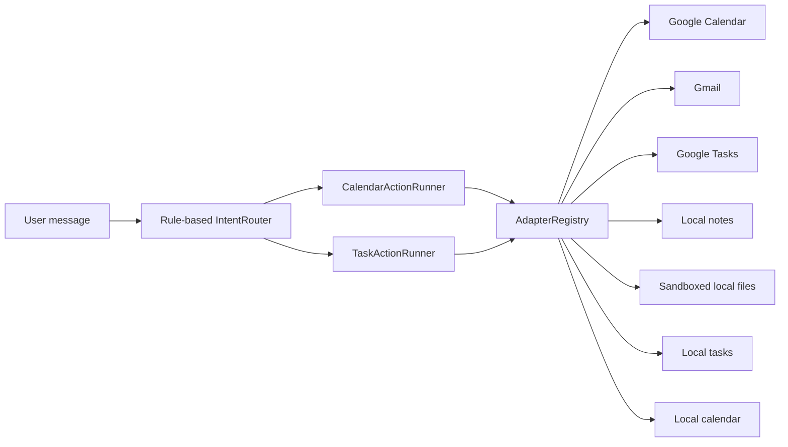

# MyVibe / VibeOS

VibeOS is a small personal automation layer that turns user intent into actions
across external tools. The current build focuses on adapter foundations: each
adapter normalizes a tool behind a small Python interface so a planner can call
it later.


## Evidence at a glance

| Verified from the repository | Count |
| --- | ---: |
| Normalized service adapters | **7** |
| Calendar and task intents | **7** |
| Google API integrations | **3** |
| Unit-test modules | **4** |
| Python source files | **17** |

## Preview

This repository is an automation foundation rather than a finished graphical
application. Its reviewed preview is therefore the implemented adapter flow.

## Architecture



> **Current scope:** routing is rule-based. It recognizes supported actions but
> is not yet an LLM planner and does not extract every field needed for arbitrary
> create/delete requests.

## What it does

- `GoogleCalendarAdapter`: list, create, and delete calendar events.
- `LocalCalendarAdapter`: persist calendar events locally for offline development and tests.
- `GmailAdapter`: list recent messages, read message metadata, and send email.
- `GoogleTasksAdapter`: list task lists, list tasks, create tasks, complete tasks, and delete tasks.
- `LocalTasksAdapter`: persist tasks locally for offline development and tests.
- `LocalNotesAdapter`: create, read, append, list, and search markdown notes.
- `LocalFilesAdapter`: list, read, and write files inside a configured root.
- `AdapterRegistry`: creates adapters by name: `calendar`, `local_calendar`, `gmail`, `tasks`, `local_tasks`, `notes`, `files`.
- `TaskActionRunner`: executes list, create, complete, and delete task intents.

## Example

```python
from adapters import default_registry
from calendar_actions import CalendarActionRunner
from intent_router import route_intent

intent = route_intent("show my next calendar events")
calendar = default_registry().create("calendar")
result = CalendarActionRunner(calendar).run(intent)

print(result.message)
```

Task requests use the same registry and intent model:

```python
from adapters import default_registry
from intent_router import route_intent
from task_actions import TaskActionRunner

intent = route_intent("show my pending tasks")
tasks = default_registry().create("tasks")
result = TaskActionRunner(tasks).run(intent)

print(result.message)
```

## Quick start

Install dependencies:

```bash
git clone https://github.com/Sriman-Kunda-056/MyVibe.git
cd MyVibe
python -m venv .venv
pip install -r requirements.txt
```

Place your Google OAuth client file at `credentials.json`, or set
`GOOGLE_OAUTH_CREDENTIALS_PATH` to its path. Calendar, Gmail, and Tasks each use
separate token files so scope changes do not break the other adapters.

The Google scopes include calendar/task mutation and Gmail read/send access.
Use a dedicated test account while developing and never commit OAuth tokens.

## Tests and validation

```bash
python -m unittest discover -s tests
```

The four tracked test modules cover the current router and adapter foundations.
They do not validate live Google accounts or arbitrary natural-language slot
extraction.

## Repository layout

```text
MyVibe/
|-- adapters/              # Calendar, Gmail, Tasks, notes, files, local task storage, and local calendar storage
|-- intent_router.py       # Rule-based intent classification
|-- calendar_actions.py    # Calendar action runner
|-- task_actions.py        # Task action runner
|-- Auth.py                # Google OAuth helper
|-- tests/                 # Unit-test modules
`-- requirements.txt
```

## Limitations

- Routing is rule-based and does not yet provide a general planning loop.
- Not every create, update, or delete intent has complete field extraction.
- Live Google integrations require broad read/write OAuth scopes and should be
  developed with a dedicated test account.
- Local file access is only safe when its configured root remains constrained.

## Numbered commit history

1. `Initial` - import the adapter and action-runner foundation.
2. `01` - document verified adapters, intents, tests, and architecture.
3. `02` - standardize the evidence-first GitHub README format.

## Suggested GitHub topics

`python` `automation` `productivity` `intent-routing` `oauth2`
`google-calendar-api` `gmail-api` `google-tasks-api`

## License and attribution

No repository-wide license file is included. Google product and API names are
used to identify optional integrations and do not imply endorsement.
